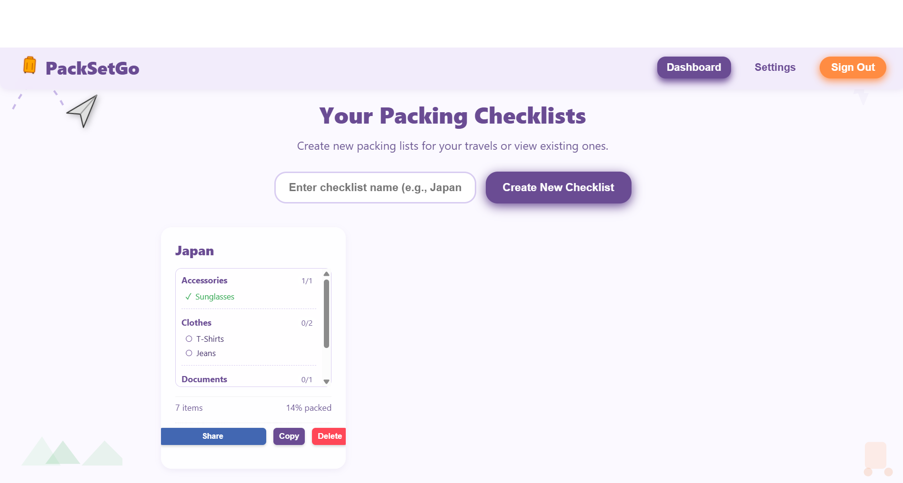
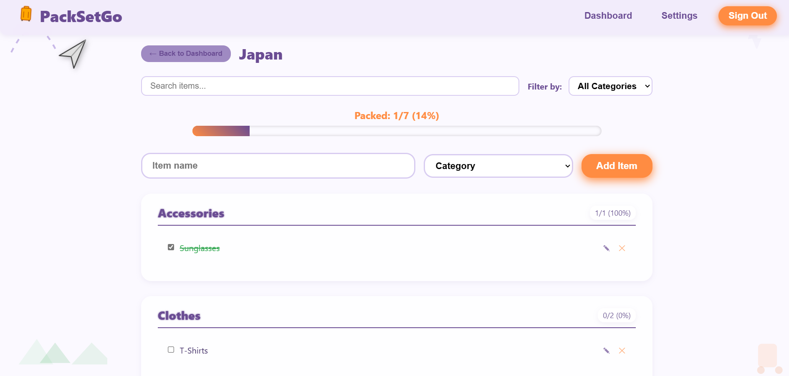

# 🧳 PackSetGo - Travel Packing Checklist App

A responsive packing checklist web application to help travelers organize and track their packing progress.

---

## ✨ Features

- 🌙 **Elegant UI with Light & Dark Mode** – Violet/lavender themed interface with customizable dark mode  
- 🧳 **Multiple Packing Lists** – Create separate checklists for different trips  
- 📋 **Category Organization** – Items automatically organized by categories (Clothes, Electronics, Documents, etc.)  
- ✅ **Progress Tracking** – Visual progress bar shows completion status  
- 🔄 **Persistent Storage** – Checklist data saved to localStorage  
- 🔍 **Search & Filter** – Easily find items across categories  
- 📱 **Fully Responsive** – Works on mobile, tablet, and desktop  
- 🔗 **Sharing** – Share your packing lists with others  

---

## 🖥️ Screenshots

###  Landing Page 


###  Dashboard  


###  Checklist Page  


---

## 🔗 Live Demo

Visit the live application: [PackSetGo](https://travelchecklistcodecircuit.netlify.app/)

---

## 🛠 Tech Stack

- **HTML5**  
- **CSS3** (Custom properties, Flexbox, Grid, Animations)  
- **Vanilla JavaScript (ES6+)**  
- **Local Storage** for data persistence  

---

## 🚀 Installation

1. **Clone this repository:**

   ```bash
   git clone https://github.com/himanshiyenugupalli/TravelChecklist_codecircuit.git
